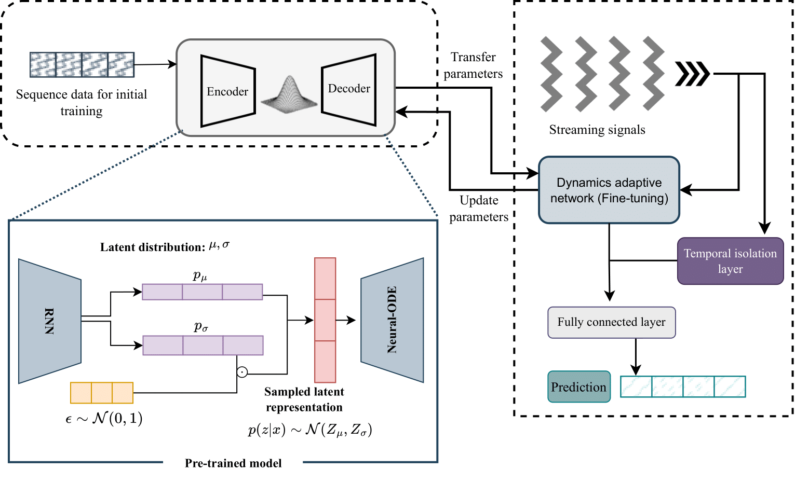

# ODEStream: A Buffer-Free Online Learning Framework with ODE-based Adaptor for Streaming Time Series Forecasting

**Note:**  Some features and documentation may be subject to change.


This repository contains the code for our state-of-the-art ODE-based model for continual learning. The code is written in PyTorch and follows the methodology described in our paper


## Model Overview




## Datasets
All datasets used are in the Dataset folder. 

## Requirements
- pytorch == 1.12


## Arguments
- lag --> lockback window size
- datasetname: 'ECL, 'ETTm1', 'ETTh1', 'ETTh2', 'WTH' --> dataste name 
- task: 's', 'ms' , 'm'  
- flag:  'initial', 'stream'  --> initial training ( model warm-up), or online learning 
- savedmodelpath = "models/"
- resultpath = "results/"
- mempath = "memory/"
- reguler = 't'


## Citation

If you use this code, please cite our paper:

```bibtex
@article{DBLP:journals/tmlr/Abushaqra0RS24,
  author       = {Futoon M. Abushaqra and
                  Hao Xue and
                  Yongli Ren and
                  Flora D. Salim},
  title        = {SeqLink: {A} Robust Neural-ODE Architecture for Modelling Partially
                  Observed Time Series},
  journal      = {Trans. Mach. Learn. Res.},
  volume       = {2024},
  year         = {2024},
  url          = {https://openreview.net/forum?id=WCUT6leXKf},
  timestamp    = {Thu, 08 Aug 2024 15:22:39 +0200},
  biburl       = {https://dblp.org/rec/journals/tmlr/Abushaqra0RS24.bib},
  bibsource    = {dblp computer science bibliography, https://dblp.org}
}
```


